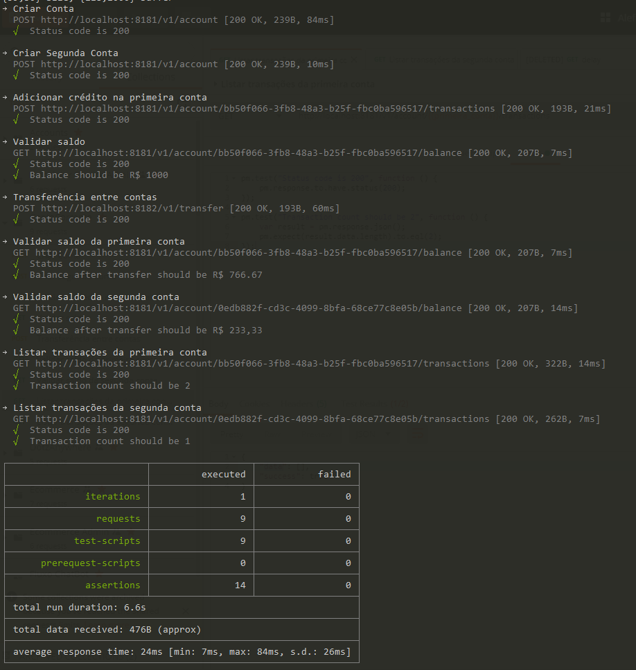

# Exemplo de operações em conta corrente

## TrasferFunds

    Microserviço responsável por fazer transações entre contas.

A operação de transfência entre contas é feita de modo assíncrona.

As consultas feitas no serviço Account contém resiliência, se uma determinada chamada ocorrer erro, será feita mais 3 tentativas.

## Account

    Microserviço responsável por operar contas corrente

As operações disponíveis são:

* Consulta de conta
* Consulta de saldo
* Consulta de extrato

> O software `Account.PublicShared` seria um pacote Nuget que pode ser adicionado por quem gostaria de emitir algum evento de transação

## Framework

    Conjunto de boillerplates contendo padrões de projetos.

## Health Check

Toda webapi tem uma rota `/healthz` que validar se todos os serviços estão operantes.

## Como executar ?

O setup do projeto pode ser feito utilizando `docker-compose` que irá suprir as seguintes dependências:

* RabbitMQ
* MongoDB

> Todas as configuração são feitas através de ENV para facilitar o deploy;

```bash
docker-compose up --build
```

### O que será entregue ?

* Account.WebApi
* Account.Consumer.TransactionHandler
* TransferFunds.WebApi

## Testes integrados

Utilizamos o `newman` pra executar testes.

```bash
npm install -g newman
```

E após ter subido todas as aplicações basta executar

```bash
newman run integrated_tests_collection.json
```

